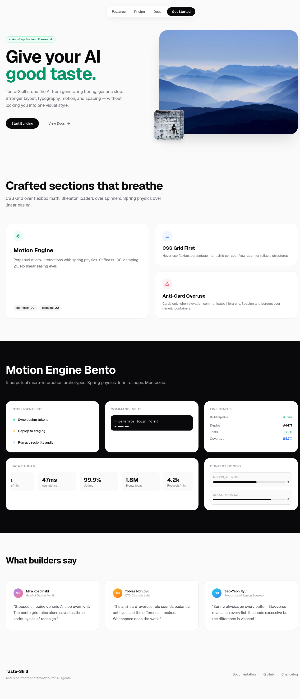
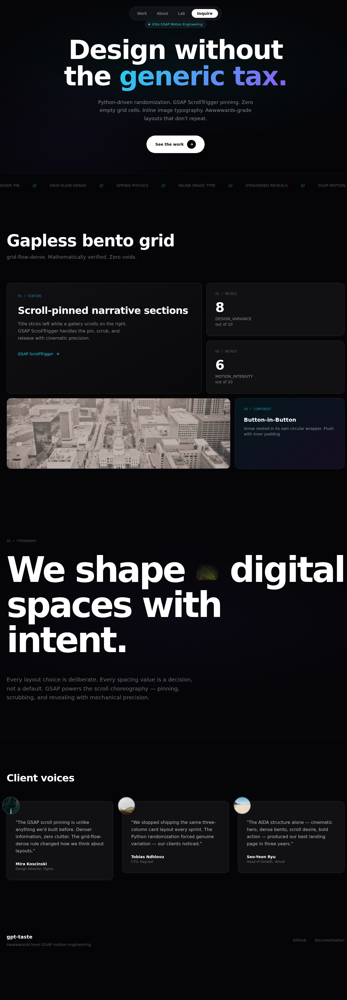
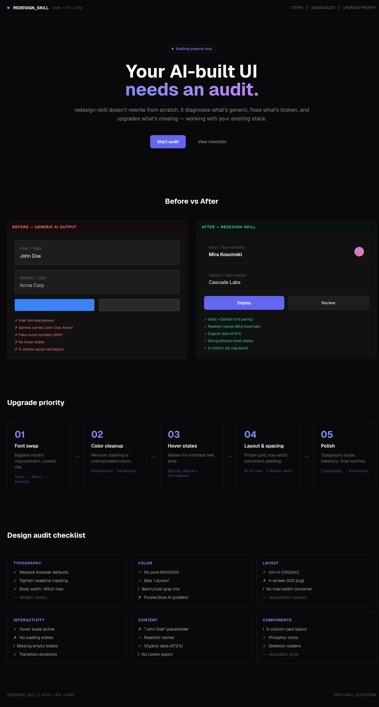
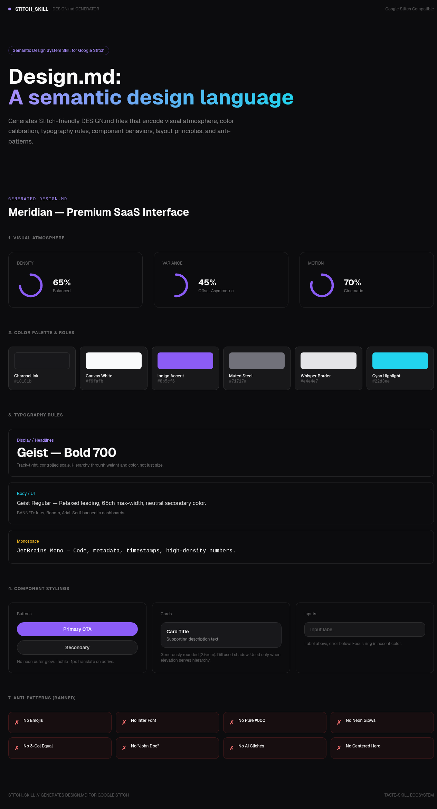

# Skill Screenshots

Visual examples of all 7 web design skills from the [taste-skill](https://github.com/leonxlnx/taste-skill) ecosystem.

---

## 1. taste-skill — Anti-Slop Frontend Framework

High-agency frontend: motion engine, bento grid, skeleton loaders, spring physics, asymmetric hero layout.

---

## 2. gpt-taste — Awwwwards-Level GSAP Motion

Dark cinematic: GSAP-style marquee, ultra-wide hero, grid-flow-dense, inline image typography.

---

## 3. soft-skill — Principal UI/UX Architecture

Warm cream surfaces: double-bezel nested cards, spring physics, editorial serif, macro-whitespace.

---

## 4. minimalist-skill — Editorial Product UI

Newsreader serif + Geist pairing, pale pastels, accordion FAQ, clean pricing table.

---

## 5. brutalist-skill — Swiss Industrial Print

Archivo Black uppercase, blueprint grid, aviation red #E61919, monospace telemetry data.

---

## 6. redesign-skill — Design Audit & Upgrade System

Before/after comparison, 5-step upgrade priority flow, 6-category audit checklist.

---

## 7. stitch-skill — Semantic Design System

DESIGN.md visualization: atmosphere dials, color palette roles, typography rules, anti-patterns.

---

*Open any .html file directly in a browser — no build step required.*
