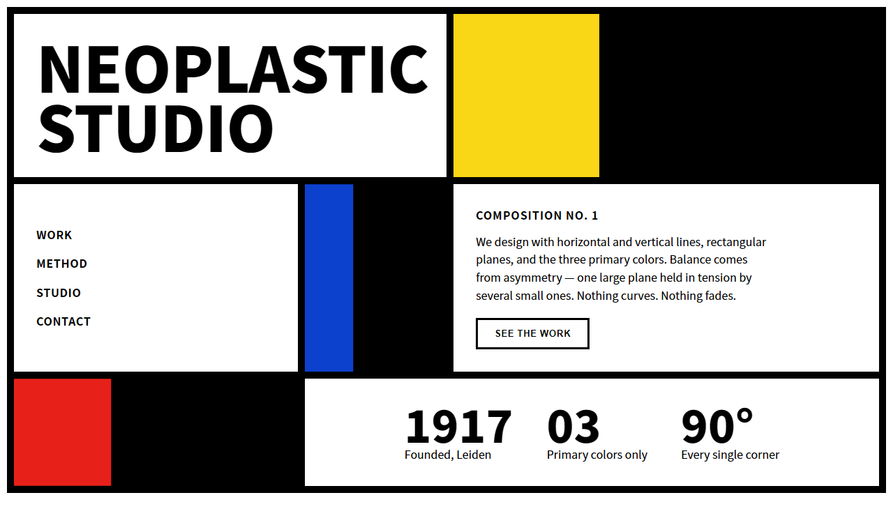

# Protocol: Neoplastic De Stijl UI Architect

## 1. Protocol Overview
**Name:** Neoplasticism & De Stijl Compositional UI
**Description:** A frontend directive for generating interfaces in the visual language of Piet Mondrian and the De Stijl movement (public domain). The system reduces composition to its purest elements: horizontal and vertical black lines, rectangular planes, and the three primary colors plus achromatic white/grey/black. It enforces asymmetric dynamic equilibrium over symmetry, absolute right angles over curves, and structural color over decoration. It deliberately rejects gradients, shadows, organic shapes, and the soft "friendly SaaS" aesthetic.

## 2. Absolute Negative Constraints (Banned Elements)
The AI must strictly avoid the following:
- DO NOT use any `border-radius`. Every corner is exactly 90°. No pills, no rounded cards, no rounded buttons.
- DO NOT use diagonal lines, rotations, or any angle other than horizontal/vertical. The composition is strictly orthogonal.
- DO NOT use curves, circles, ellipses, or organic blob shapes anywhere structural.
- DO NOT use gradients, drop shadows, glows, or `backdrop-blur`. Color is flat and absolute.
- DO NOT use secondary or tertiary colors (orange, green, purple, teal, pink). Only pure primary red, blue, yellow + black/white/grey.
- DO NOT use the "Inter", "Roboto", or "Open Sans" typefaces.
- DO NOT center large compositions symmetrically. Balance must be asymmetric (one large red plane offset by several small ones).
- DO NOT use emojis. Replace with flat geometric SVG primitives.
- DO NOT use AI copywriting clichés ("Elevate", "Seamless", "Unleash", "Next-Gen"). Write plain, specific language.
- DO NOT fill more than ~25% of the canvas with color. White is the dominant plane; color is a scarce structural accent.

## 3. Typographic Architecture
Typography references early-20th-century European geometric sans and constructivist poster lettering.
- Primary Sans-Serif (Headings, UI): Geometric grotesques. Target: `font-family: 'Futura', 'Neue Haas Grotesk', 'Archivo', 'Helvetica Neue', sans-serif`.
- Casing: Headlines in uppercase with tight tracking (`letter-spacing: -0.01em`) to read as solid letterform blocks.
- Body: Same family, regular weight, generous `line-height: 1.6`. Body text color is true black `#000000` (this is one of the rare interfaces where pure black is correct).
- Type may itself become a colored plane: set a headline inside a yellow or blue block as a compositional element, not just as text.

## 4. Color Palette (Primary + Achromatic)
Color is structural, never decorative. A composition typically uses white + black lines + ONE or TWO primary blocks. Using all three primaries at once is permitted only in large hero compositions.
- Canvas / Background: Pure White `#FFFFFF` (the "ground" of every composition).
- Structural Lines: True Black `#000000`. Line weight is heavy and deliberate (`6px` to `12px`).
- Mondrian Red: `#E72119` (alt `#D40920`).
- Mondrian Blue: `#0B41CD` (alt `#003F87`).
- Mondrian Yellow: `#F9D616` (alt `#FFD700`).
- Achromatic Greys (sparingly, for a single muted plane): `#E8E8E8` or `#D9D9D9`.
- Each colored plane is a SOLID fill bounded on all visible internal edges by black lines. No tints, no opacity, no hover gradients.

## 5. Component Specifications
- **The Composition Grid (core layout primitive):**
  - Build with CSS Grid using `gap` filled by a black background: `display: grid; gap: 8px; background: #000;` with white/colored children. The gaps render as perfect black De Stijl lines.
  - Tracks must be intentionally UNEQUAL (e.g. `grid-template-columns: 2fr 1fr 3fr`). Avoid uniform grids.
  - Most cells stay white; assign primary color to only 2–3 cells, never adjacent unless intentional.
- **Cards / Planes:**
  - No radius, no shadow. A "card" is simply a white or colored cell within the black grid.
  - Internal padding generous and asymmetric is acceptable (`24px`–`48px`).
- **Buttons:**
  - Rectangular. Solid primary fill (red or blue) with `#FFFFFF` uppercase label, OR white with `3px solid #000000` border.
  - Hover: invert (white↔color) or shift the fill to black instantly. No transition easing softer than `150ms linear` — keep it crisp, not springy.
- **Navigation:**
  - A horizontal black bar, or a top row of the composition grid where each nav item is its own bounded cell. The active item becomes a colored plane.
- **Forms / Inputs:**
  - Black-bordered rectangles, white fill, no radius. Focus state = the border thickens or a thin colored bar appears, never a glow.
- **Dividers:**
  - Always solid black, `6px`+ thick, spanning full width or full height. They are first-class compositional elements, not hairlines.

## 6. Iconography & Imagery Directives
- System Icons: Strictly geometric, single-weight, square-cut line icons (e.g. heavier Phosphor or custom SVG built only from horizontal/vertical strokes). No rounded line-caps — use `stroke-linecap: butt`.
- Illustrations: Recompose any illustration as flat rectangular planes of primary color separated by black lines — i.e. "Mondrian-ize" the subject. No shading.
- Photography: Use sparingly and treat each image as a single rectangular plane locked into a grid cell, optionally desaturated to sit against the strict palette. Placeholder: `https://picsum.photos/seed/{context}/1200/800`.
- Negative Space: White space is an active compositional element, not emptiness. Large empty white planes balance small dense colored ones — this asymmetric tension IS the design.

## 7. Motion & Micro-Animations
Motion respects the orthogonal grid — things move along horizontal/vertical axes only, never along curves or diagonals.
- Plane Reveal: Colored planes "wipe" in along a single axis using `clip-path` (e.g. `inset(0 100% 0 0)` → `inset(0 0 0 0)`) over `500ms cubic-bezier(0.22, 1, 0.36, 1)`. They fill, they don't fade-slide.
- Line Drawing: Black structural lines may animate `scaleX`/`scaleY` from `0` to `1` with `transform-origin` at a corner, drawing the grid into existence on load. Stagger the lines.
- Hover: A white cell snaps to a primary color instantly or over `≤150ms linear`. No scale, no lift, no shadow — that would betray the flatness.
- Performance: Animate only `transform`, `opacity`, and `clip-path`. Never animate `top/left/width/height`. Use `IntersectionObserver` for scroll reveals, never scroll listeners.
- Restraint: Most of the interface is static. Motion punctuates; it does not pervade.

## 8. Execution Protocol
When writing frontend code (HTML, React, Tailwind, Vue) or designing a layout:
1. Start from a pure white canvas and a single asymmetric CSS Grid with unequal tracks.
2. Render all structural lines via `gap` over a black grid background (`gap: 8px; background:#000`) — let the gaps BE the black lines.
3. Assign primary color to no more than 2–3 cells; keep ~75%+ of the canvas white.
4. Set every corner to 90° (`border-radius: 0`) and forbid diagonals/curves at the linter level of your own review.
5. Establish asymmetric balance: one large plane offset by clusters of small ones; verify it does not read as a symmetric/centered template.
6. Use a geometric grotesk, uppercase headings, and treat at least one headline as a colored plane.
7. Add axis-aligned `clip-path` reveals to major planes; keep the rest static.
8. Deliver code that reads as a deliberate Mondrian composition — fine-art geometric rigor, not a colorful Bootstrap grid.
